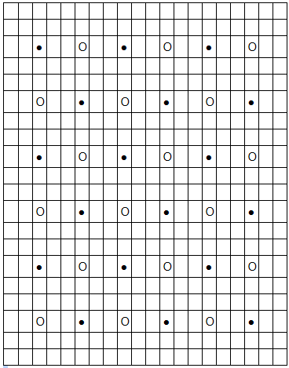
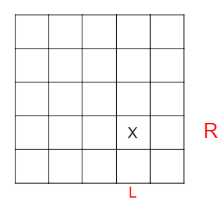

# Basic Skill

## 請解釋下編譯指令，每一個參數代表的意涵 (10%)

```bash
g++-8 -std=c++17 -O2 -Wall -Wextra -fPIC -I./ -shared AITemplate/Porting.cpp -o ./build/a1.so
```

以下是我們的解釋:
### -O2:
-O means optimizing.It can improve the performance and/or code size at the expense of compilation time and may have the ability of debugging the program. And –O2 means optimizing more. As compared to -O, this option increases both compilation time and the performance of the generated code.簡而言之就是對code size跟execution time做最佳化。
### -Wall:
This enables all the warnings about constructions that some users consider questionable, and that are easy to avoid (or modify to prevent the warning), even in conjunction with macros.幾乎包含了一般情況該警告的事項。
### -Wextra:
This enables some extra warning which are not enabled by -Wall.
### -fPIC:
If supported for the target machine, it will generate position-independent code suitable for use in a shared library and dynamic linking and avoiding any limit on the size of the global offset table.之所以要產生 position-independent code也就是產生的code只有相對地址沒有絕對位置，是因為shared library  被加載時內存的位置不固定，因此需要code可以被加載到內存的任意位置都可以正確執行。
### -I : 
adds include directory of header files. 
### -shared: 
Produce a shared object which can then be linked with other objects to form an executable.
### -o:
Write the build output to an output file.


另外，是我們補充的其他編譯指令解釋:
### -Werror          :
 regard warring as error 會將所有警告都轉成錯誤，讓編譯停止
### -Wextra          : 
print extra warring hint
### -pedantic-errors : 
follow ANSI standard, otherwise, turn warring to error

## 請解釋 Game.h 裡面 ```call``` 函數的功能 (5%)
```c
template<typename Func ,typename... Args, 
    std::enable_if_t< std::is_void<
    std::invoke_result_t<Func, AIInterface, Args...>
    >::value , int> = 0 >
void call(Func func, AIInterface *ptr, Args... args)
{
    std::future_status status;
    /*
    future_status
    包含在future標準函式庫
    future_status 後面的 status 是個 Enumeration
    共有三種 Enumerator ， 分別是:
    1. ready     值為0
    2. timeout   值為1
    3. deferred  值為2
    */
    auto val = std::async(std::launch::async, func, ptr, args...);
    /*
    val 會接收來自 std::async(std::launch::async, func, ptr, args...) 的資料
    asnyc 包含在 future 函式庫
    std::launch::async 是一種執行策略，會使 func 在新的線程執行
    func 是 ptr 裡的函數
    ptr 可以是一個物件的指標 func 則是其成員函數
    args 則是要給func 的參數
    但因為每個 func 所需要接收的參數個數可能不同
    args...這種寫法則可以解決以上問題，增加彈性
    */
    status = val.wait_for(std::chrono::milliseconds(m_runtime_limit));
    /*
    wait_for函數等待 val 接收到值，並設置時限為1000毫秒
    */
    if( status != std::future_status::ready )
    {
        exit(-1);
    }
    /*
    如果狀態不為ready (值沒有在1000ms 內接收到) ， 離開程式
    */
    val.get();
    /*
    取得 val 的值
    */
}
```
上面這個call 函式是不會回傳值得
因此另外還有個call 函式
只差了一行
```c
return val.get()  
```
會把值傳回來
## 請解釋什麼是 Shared library，為何需要 Shared library ，在 Windows 系統上有類似的東西嗎？(10%)

1. Shared library 是一個包含許多 ```object code``` 的檔案。

2. 有了shared library ， 編譯專案所產生出來的執行檔會比較小，因為執行檔和 library 是分離的，不像 static library， 把所有的程式都包在執行檔中。也因為如此，當 static library 有函式庫要更新的話，勢必就要連同執行檔也一起更新，然而 share library 卻不用。這樣的好處會在專案體積特別龐大的時候有顯著的好處。例如這一次的作業分工，在程式碼合併之前可能就要自己先編譯並測試好幾次才行。但程式碼更改的範圍通成都侷限在小範圍內，有了shared library，就能加快編譯速度。

3. 在 windows 系統裡沒有 shared library 


# Final Project

## AI Algorithm (10%)

( 請說明 AI 如何運作，進攻/防守的策略是什麼 )
### 原本預期的演算法
#### first step
在init 階段將以下黑點及白點(如以下所示)依順序推入Queue 中，作為 Ai 預設攻擊座標。
攻擊的 state 為 0。<br>
(至於為何會以此作預設攻擊目標，在稍後會進行解釋)  


#### second step

1. 在遊戲進行階段，Ai 會依據不同的state做不同的攻擊方式。

2. 一開始 Ai 的state = 0，屬於尚未發現敵人，依照Queue裡預設攻擊座標打擊的階段 (若是該座標沒被打過的話)
3. 若 state = 0時在queryreporthit收到gamerunner 回傳的 hit (攻擊到敵船) 訊號，state 從 0 變成 1 。
4. state 1 為AI發現敵船座標的狀態，Ai 會攻擊附近的點直到該船沈船，沈船後state變為 0 直到找到下一艘船的蹤跡。
5. state 1 的攻擊方式如下圖所示。假設攻擊到的點為 X，Ai先向下(x座標正向)攻擊 (在攻擊途中，如果向下一格已被攻擊過，略過該點，往下下一格攻擊) ，若gamerunner回傳 hit ，Ai 持續向下攻擊 ，直到gamerunner 回傳 no hit 。若回傳no hit ， AI 在 no hit 的x座標標示為 low_bound，然後改由從X點向上打，直到回傳no hit，由這兩點可以得知船縱向的size。上下方向打完之後，改左右方向開打，依照相同方式，可得船的right bound 及船橫向的size。若橫向的size = 縱向的size ，則得知此船為 n x n 方船，利用right bound 、low bound 、size 可算出船的中心點，然後攻擊此點，Ai 將此船範圍內的點標示為已攻擊， state變回0。(ex. 若此船為n x n 方船，僅需攻擊到空座標四次便能將此船擊沉)  
        

6. 若船橫向的size != 縱向的size ，可判斷此船是由多艘船組成的不規則型戰艦，由state 1 轉為 state 2，在此階以DFS的方式攻擊敵人的船，AI的攻擊空座標次數為不規則形船的邊長，當攻擊完時，state 跳回0 ，繼續尋找其他船艦。

### discussion
1.  此init階段內的預設攻擊方式為最有效找到 3 x 3 方船的方式，攻擊的座標均勻分布，保證能在36次攻擊內找到每一艘 3 x 3 方船
2. 以黑白方式放在 queue 的意義為在前十八次的預設點攻擊內必能攻擊到 7 x 7 的船 及 
1 - 18/256 的機率攻擊到 5 x 5 的船，若能優先將此兩艘大船擊沉，便能提早將更多點標示為已攻擊過目標，能探訪更少預設點找到兩艘 3 * 3方船
3. 若所有船均未相鄰，在  <  29 + 4*4 的攻擊空座標數內能贏得遊戲。
4. 若進入到DFS階段，所花費的攻擊空座標數為該船的周長。

### 實際上的Algorithm
ex.在實作的過程中，由於時間的不足，在判斷可能來不及在deadline前完成預期Ai 演算法的情況下，我們採取了比較簡潔的Ai 演算法

#### first step
在init 階段依上述的方法將指定座標推入Vector 中，作為 Ai 預設攻擊座標。

#### second step
1. 在遊戲進行階段，Ai會以預設座標攻擊(若是預設座標沒被攻擊過的話)
2. 一旦在queryreporthit 中gamerunner 回傳hit、攻擊到船後，Ai 會將上下左右的點推入Vector中，以 DFS 的方式將船擊沉，若有多艘船相鄰，Ai 會把所有相鄰的船所佔的海域面積打爆
3. 將此船擊沉後便會以預設座標攻擊，尋找下一艘船，直到遊戲結束


### discussion

1.  此init階段內的預設攻擊方式為最有效找到 3 x 3 方船的方式，攻擊的座標均勻分布，保證能在36次攻擊內找到每一艘 3 x 3 方船
2.  以黑白方式放在 vector 的意義為在前十八次的預設點攻擊內，必能攻擊到 7 x 7 的船 及 
1 - 18/256 的機率攻擊到 5 x 5 的船，若能優先將此兩艘大船擊沉，便能提早將更多點標示為以攻擊過目標，能探訪更少預設點找到兩艘 3 * 3方船。
3. 因為DFS的中止條件是攻擊到空座標，所以最多在 " 29 + 所有船周長的總和(無論相鄰或不相鄰) " 的攻擊空次數內會將所有戰艦擊沉。
4. 此演算法寫起來複雜度降低許多，能大幅縮短debug時間。
## 分工與進度規劃 (5%)

( 請說明團隊上的分工，每個人做了什麼，如果有進度規劃也請提供 )

### 分工:
#### 黃文遠:
1. AI 版本2 
2. gamerunner 更新資訊階段 與 攻擊階段
3. Report call函數 與 shared library 以及 排版
#### 廖凰汝: 
1. gamerunner 移動階段
2. Report 編譯指令的含意 與 分工與進度規劃
#### 陳弘輊：　
1. AI 版本1
2. Report AI版本2 Algorithm
### 進度規劃：

|日期|進度|
|:-------|:---------|
|6/1|進度規劃|
|6/2 ~ 6/7 |看懂code 理解大致上要做甚麼|
|6/8|決定分工，並開github，fork|
|6/19 ~ 6/21|各自寫好code，問題討論，互相追蹤進度|
|6/22|gamerunner merge，修好一些bug，gamerunner 完成|
|6/23|AI 做些修改，生出用dfs做的版本二，整體完成|


## 心得 (10%) 每人都要寫，不少於 100 字，Ex. 實作時有遇到什麼困難，如何排除等等。

### 黃文遠：
第一次使用github進行團隊合作，再也不是把github當作雲端硬碟用的單機俠了：）對於我們組的分工自己也挺滿意的，整個Project進行的十分有條理，做起事來就像是平常自己寫作業一樣，不需要把所有人都綁在一起才有辦法做事。在github上雖然偶爾會遇到Conflict，但總是能夠很快的解決掉，大多數時候甚至可以自動merge。  
這次的作業能把平時所學派上用場，心中滿是舒暢。從變數命名到程式碼的執行效率與正確性，這些再日常不過的小細節，在這次的作業明顯感覺到它們的重要性，也慶幸自己平時就有做好自我要求，盡可能的把程式碼一次就寫好並寫對。  
除此之外這也是我第一次去好好了解如何使用makefile。說來汗顏，自己也用了ubuntu快半年了，卻也寫過CMakelist並用CLion來跑miniProject2，而且CMakelist有大半還是別人寫好的...。有了這次的經驗，我也可以自己寫一個makefile，遇到Project也不會被IDE綁架，甚至用Vim來完成  
而這次Project中，我覺得最刺激的是要準時把程式碼交出去。畢竟是團隊作業，我們也在一開始就做好了時間規劃，程式碼延期繳交，影響的不只是個人的信用，更有可能把團隊推向來不及繳交作業的萬丈深淵。  
總的來說，這次的作業不難，但需要學的東西很多，從中也得到很多收穫，充分體現做中學的精神，是一份能夠讓人有所成長的作業。


### 廖凰汝：

### 陳弘輊：

這次的final project是第一此以團隊的方式交作業，有大神幫忙及討論的感覺真是不錯，而專案越寫越大，大到需要多人完成一個project時，感覺離真正的工程師越來越近。  
這次的project感受最深的是心有餘而力不足的無力感，在深知離deadline只有14個小時(如果不睡覺的話)，又有許多bug不確定抓不抓得到之後，感到非常不妙，於是組長就加進來一起寫，最後用組長臨時寫的第二個演算法交了上去。在交上去之後作業雖然是做完了，但起初腦袋中所想的演算法卻沒能實做出來，覺得有點不爽，覺得自己在能力上應該是要有所提升。